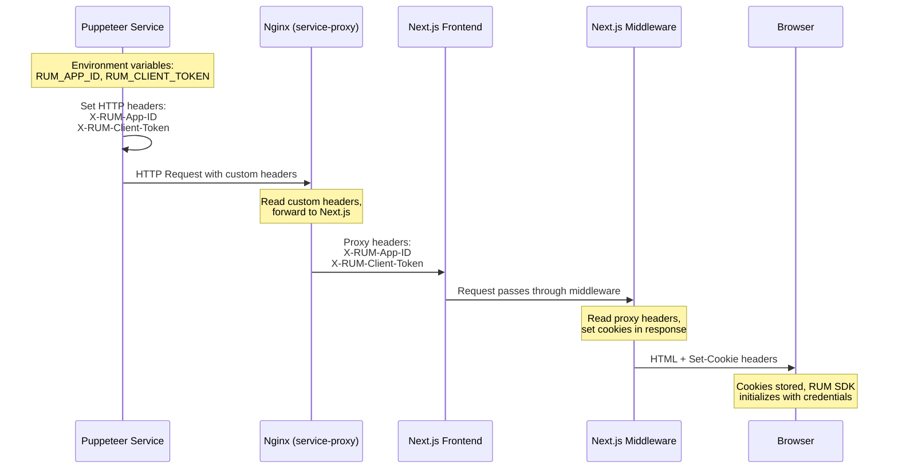
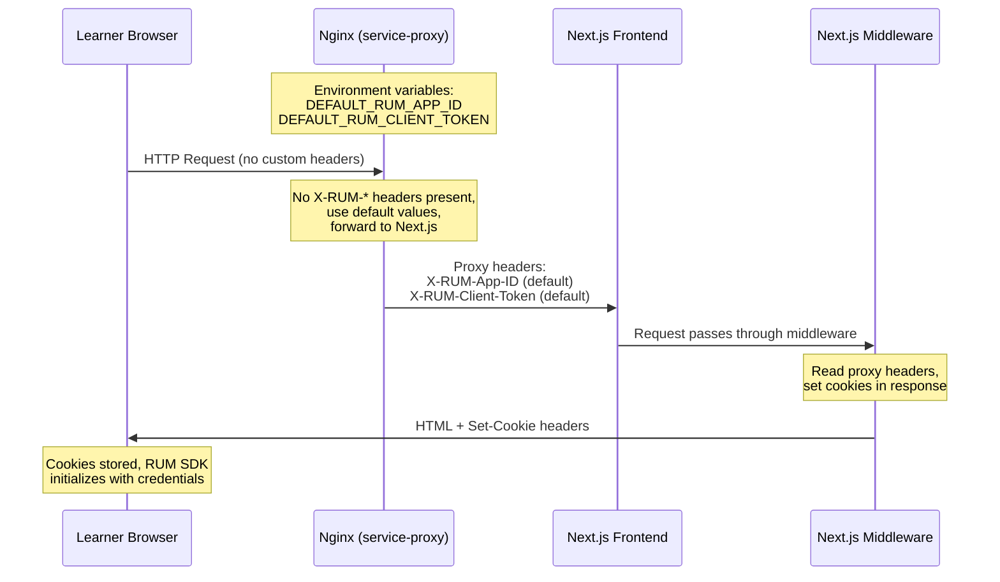

# Storedog - RUM Retention Filters Lab Version

This is a specialized branch of Storedog configured for the RUM retention filters lab. It features a custom RUM configuration system that routes traffic to multiple RUM applications based on the source (puppeteer automated sessions vs. learner browser sessions).

**Table of contents**

- [RUM Configuration Architecture](#rum-configuration-architecture)
  - [Puppeteer Sessions](#puppeteer-sessions)
  - [Learner Sessions](#learner-sessions)
- [Service changes](#service-changes)
  - [Backend](#backend)
  - [Nginx](#nginx)
  - [Frontend](#frontend)
  - [Puppeteer](#puppeteer)
- [Local development](#local-development)

## RUM Configuration Architecture

This branch implements dynamic RUM application routing that allows different traffic sources to send data to different RUM applications. This is essential for the retention filters lab, where learners investigate specific patterns in dedicated RUM applications.

### Puppeteer Sessions

Puppeteer sessions use custom HTTP headers to specify which RUM application to send data to. Nginx forwards these headers to Next.js, where middleware sets cookies in the response. This allows multiple puppeteer services to run simultaneously, each sending data to a different RUM application.



### Learner Sessions

Learner browser sessions (real users accessing Storedog through their browser) don't send custom headers. Nginx uses default RUM credentials from environment variables and forwards them to Next.js, where middleware sets cookies in the response.



**Key Differences:**

| Aspect | Puppeteer Sessions | Learner Sessions |
|--------|-------------------|------------------|
| RUM Credentials Source | Custom HTTP headers per request | Default environment variables |
| RUM Application | Multiple (short, vip, frustration) | Single ("practice") |
| Session Debug Panel | Hidden | Visible |
| User Type | Random fake users (various personas) | "Learning Center User" |

## Service changes

### Backend 

Has an extra endpoint for the about-us page. This is to illustrate poor Largest Contentful Paint performance on the frontend. This must be used in conjunction with Puppeteer sessions that visit the /about-us page on Storedog's frontend.


### Nginx

Reads custom headers from puppeteer (or uses defaults for learners) and forwards them as proxy headers to Next.js. The headers are:
- `X-RUM-App-ID` - RUM application ID
- `X-RUM-Client-Token` - RUM client token

Configuration is in `services/nginx/default.conf.template`.


### Frontend

RUM configuration is handled at runtime via Next.js middleware (`middleware.ts`), which:
1. Reads `X-RUM-App-ID` and `X-RUM-Client-Token` headers forwarded by nginx
2. Sets `rum_app_id` and `rum_client_token` cookies in the response
3. Browser JavaScript reads these cookies to initialize the RUM SDK

There is a RUM Debug popover in Storedog that displays when a learner visits Storedog. The popover displays live RUM Events and updates to help illustrate how often new RUM Events/updates are generated and indicate how often they will be evaluated against the RUM Application's Retention filters.

### Puppeteer

Major refactor. 

> [!NOTE]
> 
> The `docker-compose` file does not include puppeteer. The course associated with this branch runs Puppeteer in a separate host.

## Local development

1. Set environment variables.

    ```bash
    cp env.development.template .env
    ```

1. Build and run the containers.

    For local development:

    ```bash
    docker compose -f docker-compose.dev.yml up -d
    ```

    For lab/lab-based development:

    ```bash
    docker compose up -d
    ```
